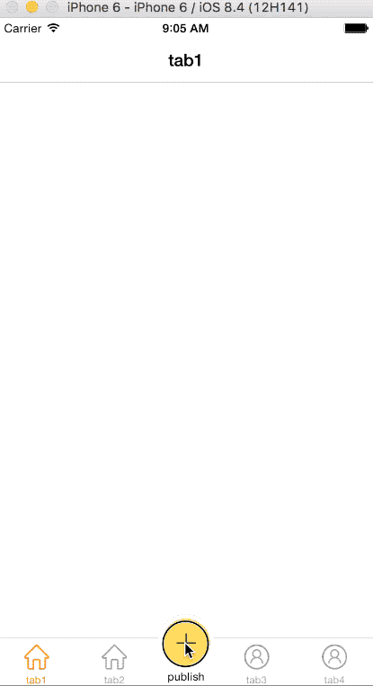
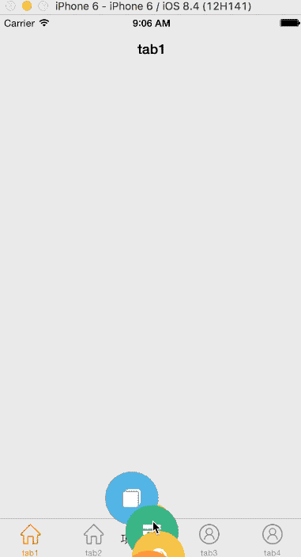

[](https://raw.githubusercontent.com/MrCQ/PopMenu/master/LICENSE)&nbsp;
[](https://www.apple.com/nl/ios/)&nbsp;

# PopMenu
A animated PopMenu for the iOS app in Swift.






## Requirements

- iOS 8.0+
- Swift 2.2

## Installation
### Manually
1. Download and drop /popmenu in your project.
2. finish!

## Usage

```
let popMenu = PopMenu(frame: self.window!.bounds, item: itemArray);
popMenu.type = .Diffuse;
                
popMenu.itemClicked = { index in
    print("the \(index)'s item was clicked.");
}

popMenu.showMenuAtView(self.window!);

```

have fun !

## Addition

use [WSTabBarController](https://github.com/chisj/WSTabBarController) to finish the demo proj.

## License

PopMenu is available under the MIT license. See the LICENSE file for more info.
